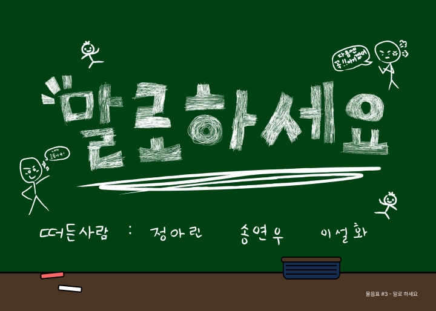
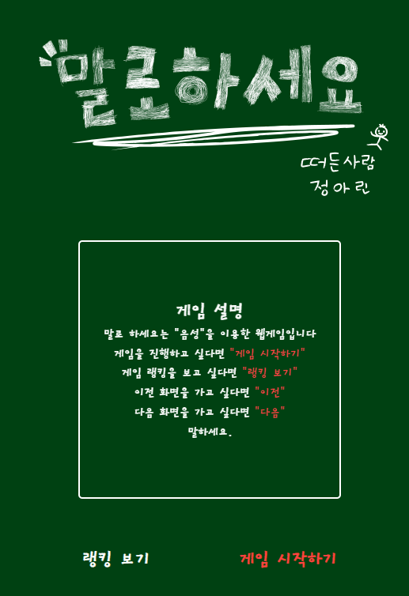
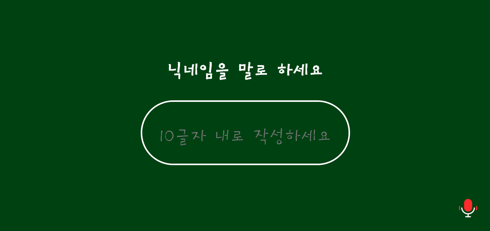
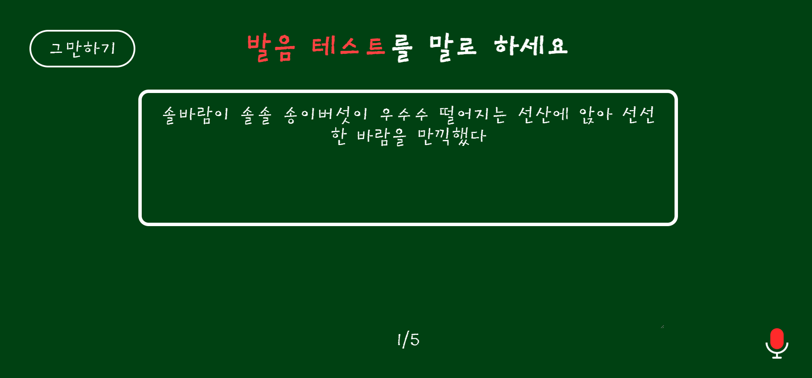
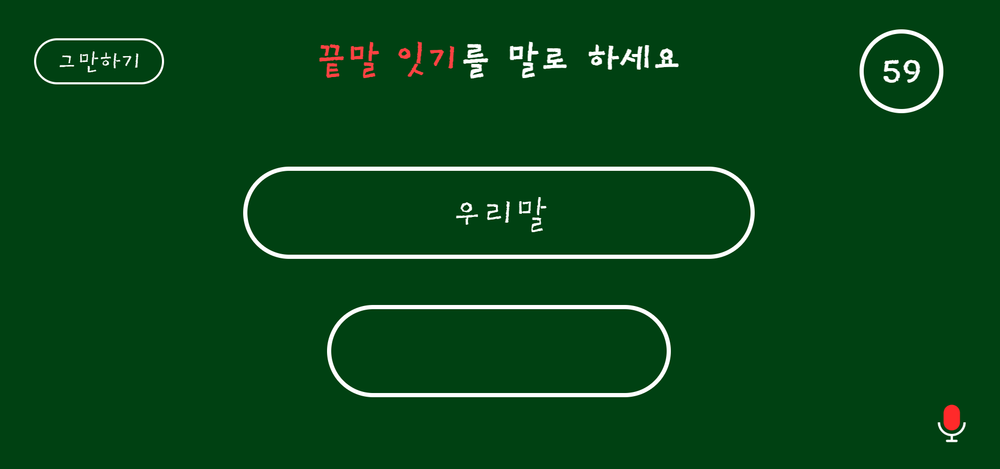
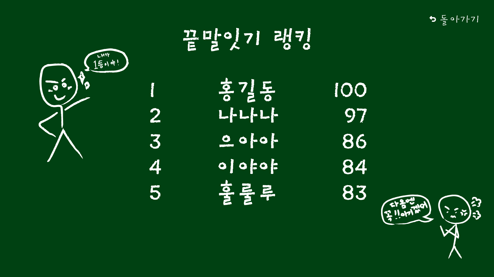

# 말로 하세요

1. 프로젝트 소개
2. 주요 화면 소개

---
## 프로젝트 소개

 

- 서비스 소개
  
“말로하세요”는 음성인식 기술을 활용한 웹 게임입니다.
사용자의 발음 정확도를 테스트하고, 끝말잇기와 같은 게임을
음성만으로 즐길 수 있게 해줍니다. 단순한 게임을 넘어,
음성과 상호작용하는 새로운 방식의 재미를 경험할 수 있습니다. 

- 기획의도
    
“말로하세요”는 어릴 적부터 즐겨했던 게임인 발음 테스트와
끝말잇기를 음성인식 기술을 통해 색다르게 진행하고자 합니다. 또한 음성을 통해 모든 연령대가 쉽고 재미있게 게임에 접근할 수 있는 길을 만들고자 합니다.

- 기술 정보
  
  HTML, CSS, JAVASCRIPT,  PHP, MYSQL, AWS

- 향후 운영 및 개선
 다양한 게임을 추가하여 웹사이트의 매력을 높일 것입니다.
또한, 독자적인 음성 AI 개발을 통해 음성 인식률을 높이고, 사용자의 명령을 더 정확하게 처리할 수 있도록 개선할 계획입니다.
---

## 주요 화면 소개

  - 메인화면

     

- 이름 입력 화면

     

- 발음테스트 화면

     

- 끝말잇기 화면

     

- 랭킹 화면

     

